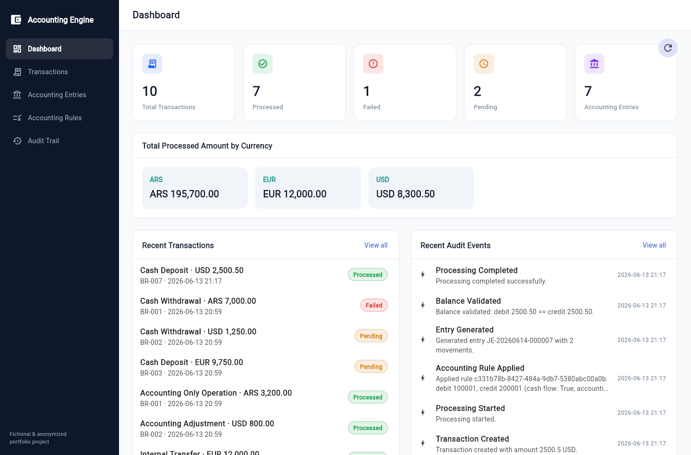
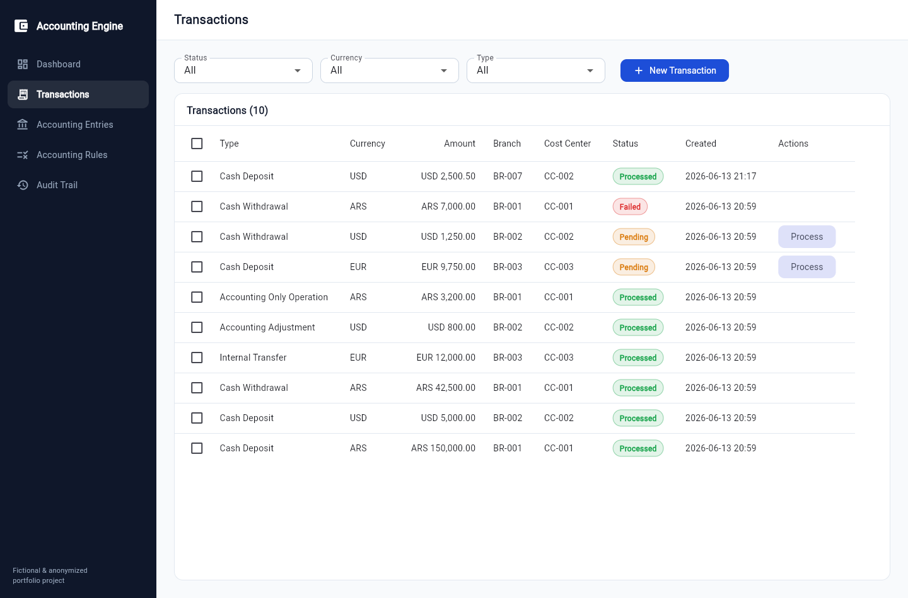
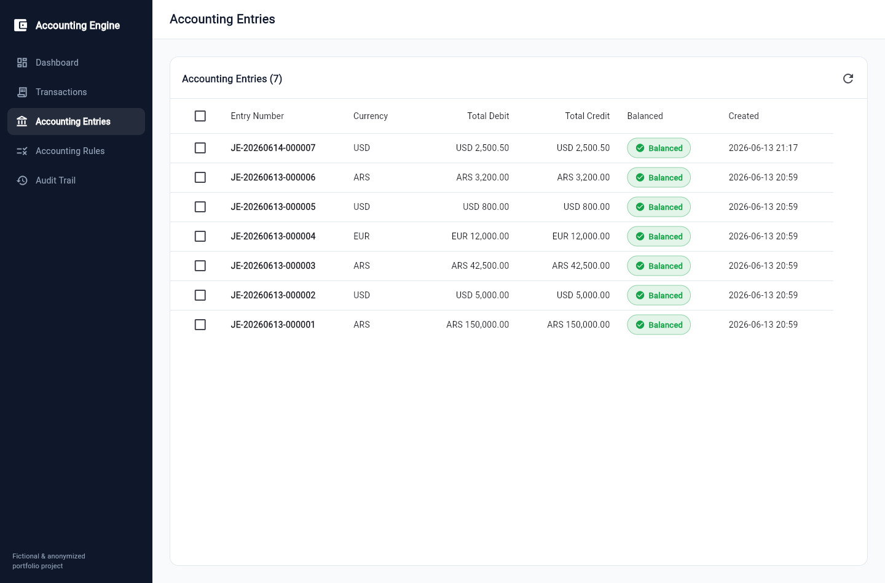

# Financial Accounting Engine

A double-entry **accounting engine** that turns financial transactions into balanced
debit/credit journal entries by applying configurable accounting rules — with full balance
validation, an audit trail, a REST API and a Flutter Web dashboard.

> **Backend:** .NET 10 · ASP.NET Core · EF Core · PostgreSQL · Clean Architecture
> **Frontend:** Flutter Web · **Infra:** Docker Compose

---

## Why this project exists

Real banking and fintech back-offices don't just CRUD records — they encode **accounting logic**:
every operation must produce a balanced journal entry, follow configurable posting rules, separate
cash-flow operations from ledger-only ones, and leave an auditable trail. This project models that
problem end-to-end in a clean, testable way, as a portfolio piece. It is **fictional and fully
anonymized** (see the disclaimer at the bottom).

## Main features

- **Financial transactions** with five operation types and a `PENDING → PROCESSED / FAILED`
  lifecycle.
- **Configurable accounting rules** that map a transaction type (and optional currency) to debit
  and credit accounts, including cash-flow vs. accounting-only behavior and cost-center handling.
- **Double-entry engine** that generates balanced journal entries and **validates that total debit
  equals total credit** before committing.
- **Audit trail / journal**: every processing step (`TRANSACTION_CREATED`, `PROCESSING_STARTED`,
  `ACCOUNTING_RULE_APPLIED`, `ENTRY_GENERATED`, `BALANCE_VALIDATED`, `PROCESSING_COMPLETED`,
  `PROCESSING_FAILED`) is persisted.
- **Dashboard summary** endpoint with counts by status, totals by currency, and recent activity.
- **REST API** documented with Swagger/OpenAPI, structured logging with Serilog, request validation
  with FluentValidation and a consistent `Result`/`ProblemDetails` error model.
- **Flutter Web dashboard** consuming the API: dashboard, transactions, entries, rules and audit.
- **Tests**: 28 unit and integration tests (xUnit + FluentAssertions).
- **Seeded data** so the API and dashboard show meaningful content on first run.

## Tech stack

| Area | Technology |
| --- | --- |
| Language / runtime | C# / .NET 10 |
| Web | ASP.NET Core Web API (controllers) |
| Persistence | Entity Framework Core 10 + PostgreSQL (Npgsql) |
| Validation | FluentValidation |
| Logging | Serilog (structured + request logging) |
| Docs | Swagger / OpenAPI (Swashbuckle) |
| Testing | xUnit, FluentAssertions, EF Core InMemory, `WebApplicationFactory` |
| Frontend | Flutter Web (Material 3) |
| Containers | Docker + Docker Compose |

## Architecture overview

Clean Architecture with four backend layers (`Domain → Application → Infrastructure → Api`).
The domain holds entities, invariants and the pure entry-generation logic; the application layer
orchestrates use cases against persistence abstractions; infrastructure implements them with EF Core.

See **[docs/architecture.md](docs/architecture.md)** for the full diagram and rationale.

```
financial-accounting-engine/
├── src/
│   ├── FinancialAccountingEngine.Domain/          # entities, enums, domain services, Result/Error
│   ├── FinancialAccountingEngine.Application/      # use cases, DTOs, validators, abstractions
│   ├── FinancialAccountingEngine.Infrastructure/   # EF Core, repositories, migrations, seeder
│   └── FinancialAccountingEngine.Api/              # controllers, middleware, Swagger, DI
├── tests/
│   ├── FinancialAccountingEngine.UnitTests/        # domain + engine + dashboard
│   └── FinancialAccountingEngine.IntegrationTests/ # API via WebApplicationFactory
├── frontend/
│   └── financial_accounting_engine_app/            # Flutter Web dashboard
├── docs/                                           # architecture, business rules, API examples
└── docker-compose.yml
```

## Documentation

| Doc | Contents |
| --- | --- |
| [docs/architecture.md](docs/architecture.md) | Layers, dependencies and key design decisions |
| [docs/business-rules.md](docs/business-rules.md) | Transaction types, rules, balance validation, audit |
| [docs/api-examples.md](docs/api-examples.md) | Request/response examples for every endpoint |
| [docs/development.md](docs/development.md) | Setup, running, tests and troubleshooting |
| [docs/decisions.md](docs/decisions.md) | Technical decisions and the reasoning behind them |
| [docs/PROJECT_LOG.md](docs/PROJECT_LOG.md) | Build & verification log (what was done and proven) |
| [CLAUDE.md](CLAUDE.md) | Project context and conventions for AI assistants |

## Business flow

1. A financial transaction is created and stays in `PENDING`.
2. The user triggers processing.
3. The engine looks for an **active** accounting rule for the transaction type and currency.
4. The engine generates debit and credit movements.
5. The engine validates that **total debit == total credit**.
6. On success the transaction becomes `PROCESSED`; otherwise `FAILED`.
7. Audit events are recorded throughout.

Full details in **[docs/business-rules.md](docs/business-rules.md)**.

## API

Endpoints (see **[docs/api-examples.md](docs/api-examples.md)** for payloads):

| Area | Endpoints |
| --- | --- |
| Transactions | `POST /api/transactions` · `GET /api/transactions` · `GET /api/transactions/{id}` · `POST /api/transactions/{id}/process` |
| Accounting entries | `GET /api/accounting-entries` · `GET /api/accounting-entries/{id}` · `GET /api/accounting-entries/by-transaction/{transactionId}` |
| Accounting rules | `GET /api/accounting-rules` · `POST /api/accounting-rules` · `PUT /api/accounting-rules/{id}` · `PATCH /api/accounting-rules/{id}/activate` · `PATCH /api/accounting-rules/{id}/deactivate` |
| Audit | `GET /api/audit` · `GET /api/audit/by-transaction/{transactionId}` |
| Dashboard | `GET /api/dashboard/summary` |

## Screenshots

Flutter web client, running against the Dockerized API + PostgreSQL with the seeded data.

| Dashboard | Transactions | Accounting entries |
| --- | --- | --- |
|  |  |  |

## Running the project

### Option A — Docker Compose (recommended)

Brings up PostgreSQL and the API. The database is migrated and seeded automatically on startup.

```bash
docker compose up --build
```

- API + Swagger UI: <http://localhost:8080>
- PostgreSQL: `localhost:5432` (`postgres` / `postgres`, database `financial_accounting`)

### Option B — Run the backend manually

Requires the .NET 10 SDK and a reachable PostgreSQL instance. Configure the connection string via
`ConnectionStrings__Default` (or edit `src/FinancialAccountingEngine.Api/appsettings.json`):

```bash
# start a local Postgres however you like, then:
export ConnectionStrings__Default="Host=localhost;Port=5432;Database=financial_accounting;Username=postgres;Password=postgres"
dotnet run --project src/FinancialAccountingEngine.Api
```

The app applies EF Core migrations and seeds data on startup. Swagger UI is served at the app root.

### Option C — Run the Flutter frontend

Requires the Flutter SDK with web support enabled. The API base URL is configurable (defaults to
`http://localhost:8080`):

```bash
cd frontend/financial_accounting_engine_app
flutter pub get
flutter run -d chrome --dart-define=API_BASE_URL=http://localhost:8080
```

See **[frontend/financial_accounting_engine_app/README.md](frontend/financial_accounting_engine_app/README.md)**
for details.

## Running the tests

```bash
dotnet test
```

Runs the unit tests (domain entities, the accounting engine, the dashboard service) and the
integration tests (the full HTTP pipeline against an in-memory database via `WebApplicationFactory`).

Covered scenarios include: creating a valid transaction, rejecting non-positive amounts, processing
with an active rule, failing when no rule exists, generating a balanced entry, detecting an
unbalanced entry, processing an accounting-only operation without cash flow, recording the audit
trail, and validating the dashboard summary.

---

## Recruiter Notes

This project is designed to demonstrate, in one cohesive codebase, the skills expected from a
backend engineer working on financial/banking systems:

- **Backend architecture** — Clean Architecture with clear layer boundaries, dependency inversion
  via persistence abstractions, the Result pattern, and centralized error handling.
- **Financial domain modeling** — a rich domain (transactions, configurable posting rules, journal
  entries with movements, audit events) where invariants live in the entities, not in controllers.
- **Accounting consistency** — true double-entry generation with explicit balance validation
  (`total debit == total credit`) and a clear `PROCESSED` / `FAILED` outcome.
- **API design** — RESTful, resource-oriented endpoints, correct status codes, `ProblemDetails`
  errors, request validation, and OpenAPI/Swagger documentation.
- **Testing** — meaningful unit tests for the domain and engine plus integration tests that exercise
  the real HTTP pipeline, using the in-memory provider for fast, deterministic runs.
- **Observability** — structured logging with Serilog and a persistent, queryable audit trail for
  every processing step.
- **Docker** — a multi-stage API image and a Compose stack that runs the database and the API with
  automatic migration and seeding.
- **Frontend integration** — a Flutter Web dashboard that consumes the API and presents the domain
  in a clean, professional UI, showing end-to-end product thinking.

---

## Disclaimer

> This project is a fictional and fully anonymized portfolio project inspired by real-world
> financial system challenges. It does not contain proprietary code, business rules, data,
> endpoints, names, or internal architecture from any company.
